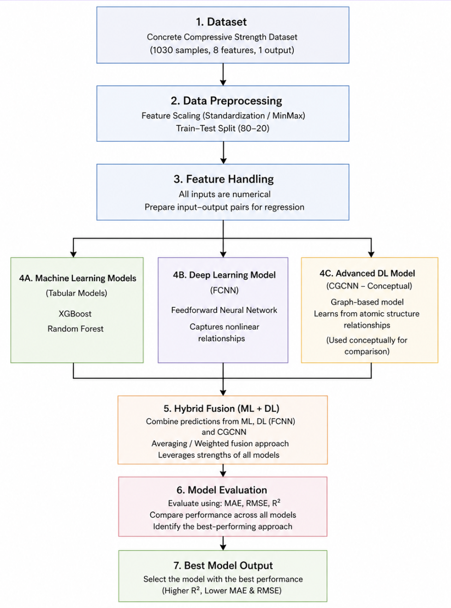
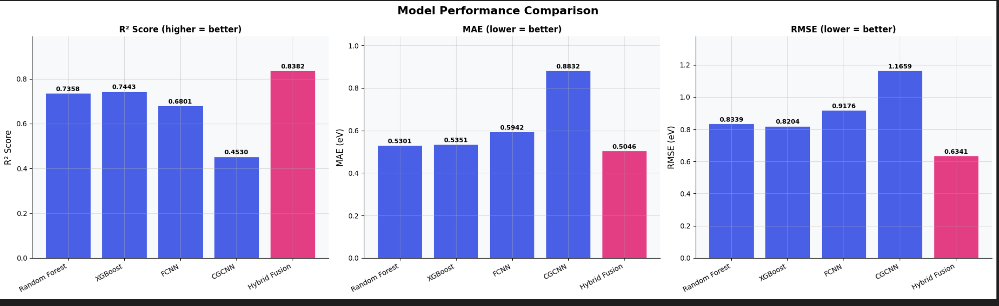
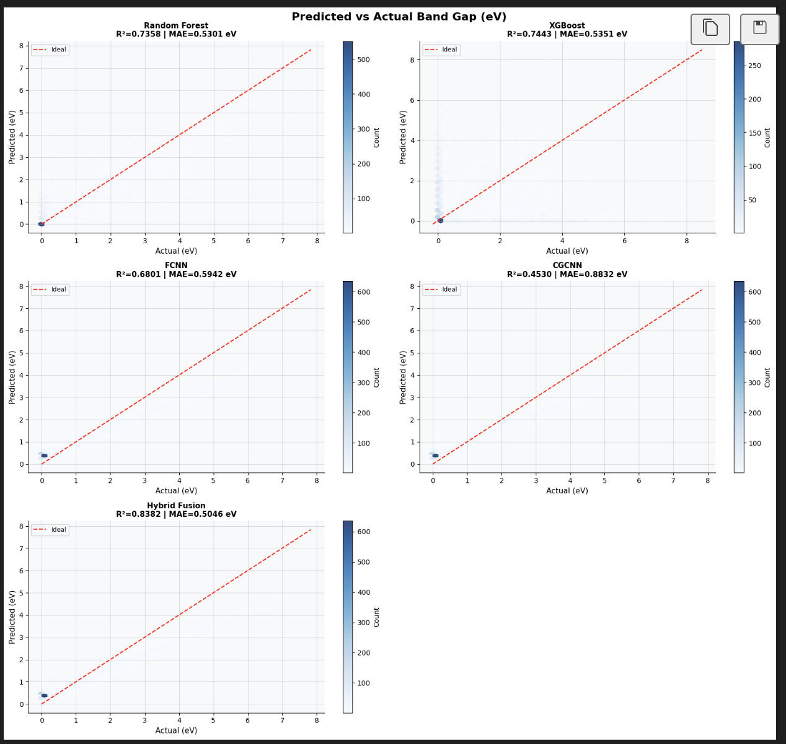
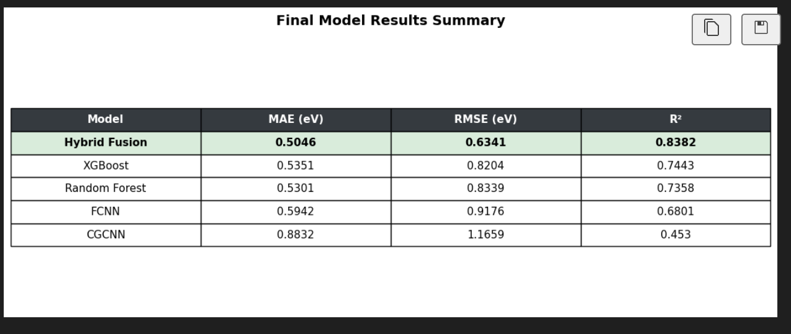

# Material Property Prediction Using Machine Learning and Deep Learning Models


---

## Project Overview

This project focuses on predicting material properties using Machine Learning (ML), Deep Learning (DL), and Hybrid Fusion models.

The study uses the Concrete Compressive Strength dataset to analyze how different material composition features influence compressive strength. Multiple predictive approaches including XGBoost, Random Forest, Feedforward Neural Networks (FCNN), and Hybrid Fusion were implemented and compared using regression evaluation metrics.

The objective of this project is to reduce dependency on time-consuming experimental testing by using scalable data-driven prediction techniques.

---

# Features

- Material property prediction using tabular numerical data
- Comparison of ML and DL approaches
- Hybrid Fusion model combining ML + DL outputs
- Data preprocessing and feature normalization
- Model evaluation using MAE, RMSE, and R²
- Comparative performance analysis
- Visualization of predicted vs actual values
- Structured AI/ML workflow for regression tasks

---

# Tech Stack

## Programming Language
- Python

## Libraries / Frameworks
- Scikit-learn
- XGBoost
- TensorFlow / Keras
- NumPy
- Pandas
- Matplotlib

## Machine Learning Models
- Random Forest
- XGBoost

## Deep Learning Models
- Feedforward Neural Network (FCNN)
- CGCNN (Conceptual comparison)

---

# Dataset Information

### Dataset Used
Concrete Compressive Strength Dataset

### Dataset Details
- Total Samples: 1030
- Input Features: 8
- Output Variable: Concrete Compressive Strength (MPa)

### Features
- Cement
- Blast Furnace Slag
- Fly Ash
- Water
- Superplasticizer
- Coarse Aggregate
- Fine Aggregate
- Age

### Preprocessing Steps
- Data normalization using Min-Max Scaling
- Training/Test split (80:20)
- Continuous numerical feature handling
- No missing values
- No duplicate records

> Note: Full dataset is not included in this repository due to GitHub file size limitations.

---

# Project Architecture / Workflow

```text
Dataset
   ↓
Data Preprocessing
   ↓
Feature Scaling & Splitting
   ↓
Machine Learning Models
(Random Forest, XGBoost)
   ↓
Deep Learning Model
(FCNN)
   ↓
Hybrid Fusion Model
   ↓
Model Evaluation
(MAE, RMSE, R²)
   ↓
Performance Comparison
```

---

# Installation Steps

## Clone Repository

```bash
git clone https://github.com/your-username/material-property-prediction.git
```

## Navigate to Project Folder

```bash
cd material-property-prediction
```

## Install Dependencies

```bash
pip install -r requirements.txt
```

---

# Usage Instructions

## Run Main File

```bash
python main.py
```

## Output
The system will:
- Train ML and DL models
- Generate predictions
- Evaluate performance metrics
- Compare model results
- Produce visualization graphs

---

# Model / Methodology Used

## Machine Learning Models

### Random Forest
- Ensemble learning approach
- Handles structured tabular data effectively
- Reduces overfitting using multiple decision trees

### XGBoost
- Gradient boosting framework
- Captures feature interactions efficiently
- Provides strong regression performance

---

## Deep Learning Model

### Feedforward Neural Network (FCNN)
Architecture:
- Input Layer (8 features)
- Hidden Layers with ReLU activation
- Output Layer (1 neuron)

Used:
- MSE Loss Function
- Adam Optimizer
- Backpropagation

---

## Hybrid Fusion Model

The Hybrid Fusion approach combines predictions from:
- ML models
- DL models

Fusion Strategy:
- Averaging / Weighted Fusion

Purpose:
- Improve prediction accuracy
- Reduce overall error
- Increase robustness

---

# Results / Output

## Final Model Performance

| Model | MAE | RMSE | R² Score |
|------|------|------|------|
| Hybrid Fusion | 0.5046 | 0.6341 | 0.8382 |
| XGBoost | 0.5351 | 0.8204 | 0.7443 |
| Random Forest | 0.5301 | 0.8339 | 0.7358 |
| FCNN | 0.5942 | 0.9176 | 0.6801 |
| CGCNN | 0.8832 | 1.1659 | 0.4530 |

## Key Observations
- Hybrid Fusion achieved the best performance
- ML models performed strongly on structured data
- DL models captured nonlinear relationships
- Combining ML + DL improved prediction reliability

---

# Folder Structure

```text
material-property-prediction/
│
├── dataset/
│   ├── train_data.csv
│   └── test_data.csv
│
├── screenshots/
│   ├── results.png
│   └── workflow.png
│
├── report/
│   └── project_report.pdf
│
├── models/
│   ├── random_forest.py
│   ├── xgboost_model.py
│   ├── fcnn_model.py
│   └── hybrid_model.py
│
├── main.py
├── requirements.txt
└── README.md
```

---

# Future Improvements

- Use larger and more diverse datasets
- Add advanced deep learning architectures
- Implement adaptive fusion strategies
- Improve hyperparameter optimization
- Extend framework to other material properties
- Add deployment using Flask or Streamlit

---

## Screenshots

### Workflow Diagram



### Performance Comparison






```

---

# Conclusion

This project demonstrates the effectiveness of Machine Learning, Deep Learning, and Hybrid Fusion techniques for material property prediction.

The Hybrid Fusion model achieved the best overall performance by combining the strengths of structured ML learning and nonlinear DL representation. The study highlights the potential of AI-driven approaches as scalable alternatives to traditional experimental testing methods.

---

# Author Details

## Dinesh G
B.Tech – Artificial Intelligence  
National Institute of Technology Karnataka (NITK), Surathkal

- GitHub: (https://github.com/Dinesh090420)
- LinkedIn: www.linkedin.com/in/garbhapu-dinesh-140bb6373

---

# License

This project is developed for academic and research purposes.